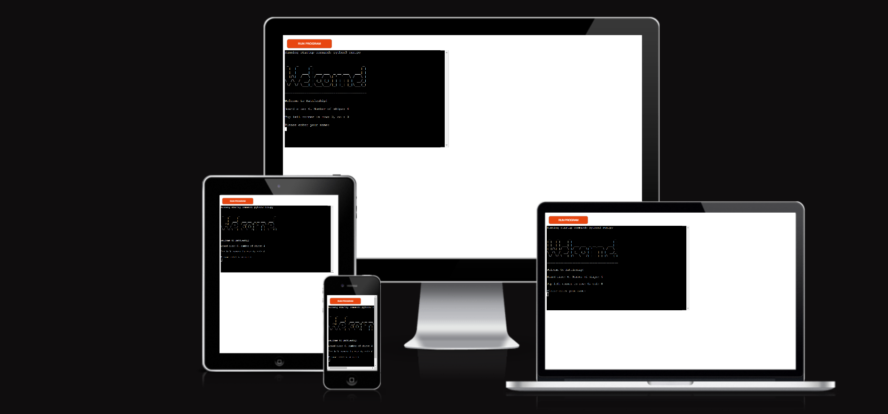
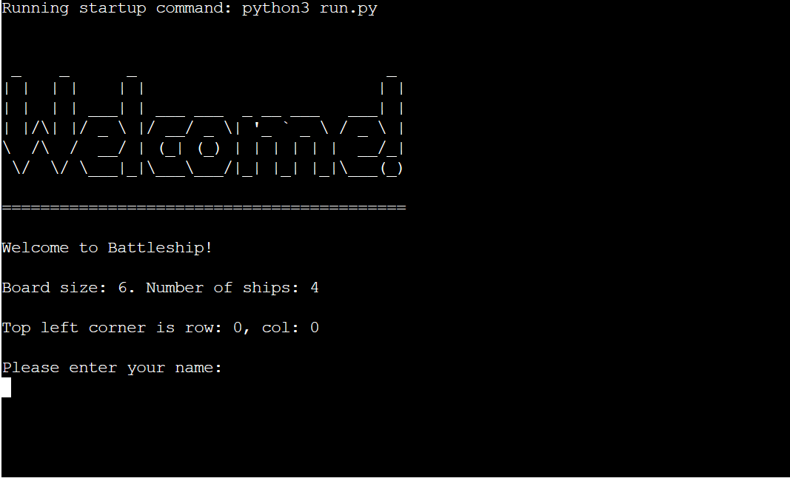
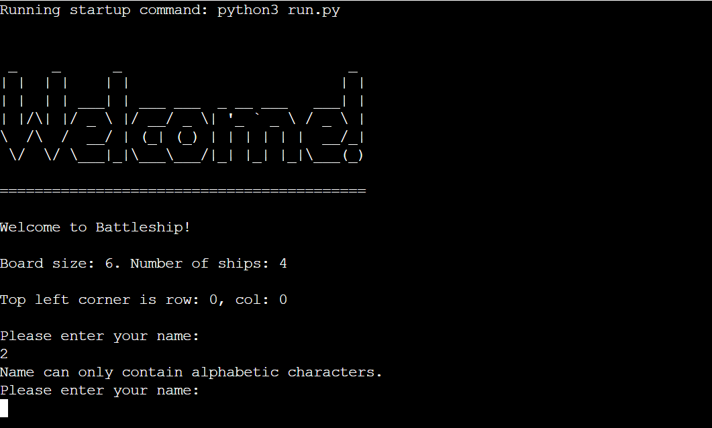
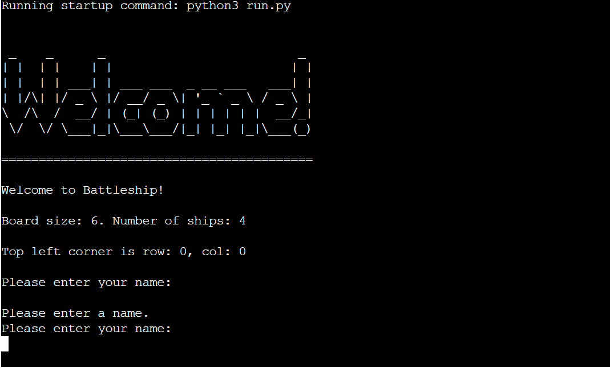
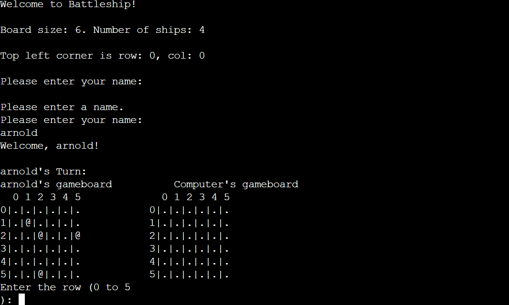
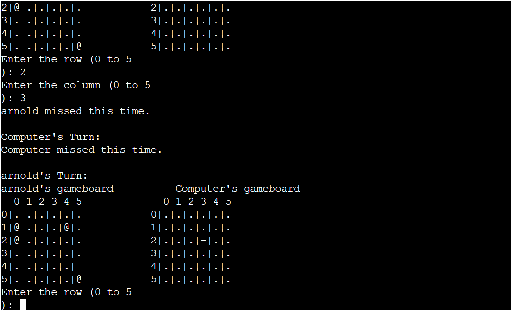
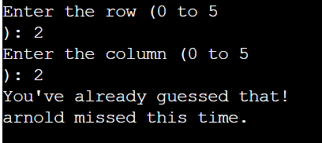
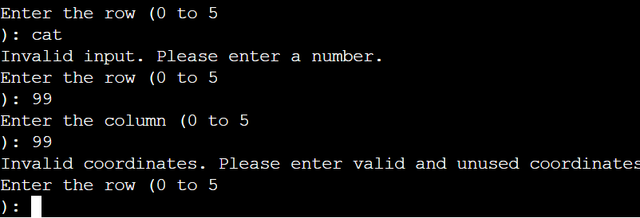
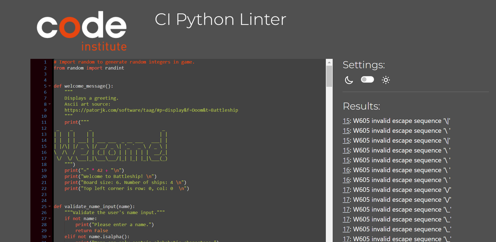

# Battleships

Welcome to Battleships, a classic naval strategy game brought to life in Python! This console-based game allows you to engage in a thrilling battle against the computer.  It is a turn-based guessing game where you play against the computer and try to sink your enemies battleships before your own fleet is destroyed.


By developing the game on Code Institutes Python Template, it can be run in a web browser, as opposed to only being able to run on a CLI or Command Line Interface.



# Table of Contents

- [Battleships](#battleships)
- [How to play](#how-to-play)
- [User Experience](#user-experience)
  - [Site Goals](#site-goals)
  - [User Goals](#user-goals) 
- [Structure](#structure)  
- [Features](#features)
  - [Welcome Message](#welcome-message)
  - [Game Boards](#game-boards)
  - [Future Futures](#future-futures)
- [Data model](#data-model)
- [Testing](#testing)
  - [Validator Testing](#validator-testing)
  - [Manual Testing](#manual-testing)
- [Bugs](#bugs)
- [Remaining Bugs](#remaining-bugs)
- [Technologies Used](#technologies-used)
  - [Languages](#languages) 
  - [Python Libraries](#python-libraries) 
  - [Programs & Libraries](#programs--libraries)   
- [Deployment](#deployment)
- [Credits](#credits)

  


## How to play
Battleships is a board game based on the classic pen-and-paper version. The objective is to sink all your opponent's ships before your own ships are destroyed. In this version of the game, players start by entering their names, and two boards are randomly generated. The user can see their own ships marked by an '@' sign but cannot see the computer's ships. Guesses that aren't hits are marked with a '-' sign, while hits are marked with an 'X'. The user and the computer take turns making guesses and attempting to sink each other's battleships. The winner is the first to successfully sink the opponent's battleships.

## User Experience

### Site Goals
- Create a fun and well-functioning mini game in a CLI environment.
- Provide a intuitive navigation throughout the game and give the user a positive overall impression.
- Write clean and readable code on which the game runs, and make sure the game doesn't break on any user inputs.

### User Goals
- Play a fun and simple game against the computer.
- Understand the logic of the game easily.
- Understand the way the game works and navigation of the game instantly.

## Structure

The structure of the Battleships game is kept as simple as posible for a easy navigation and to be easy to play with simple interactions from the user. It has a name imput and coordinates imputs with clear guidance from the game.

## Features

In this section I will provide an overview of the features included in Battleships. The game is built on the Code Institute Python Template, which provides the HTML and CSS code necessary to play the game in a browser. As that code is not written by the developer, its features will not be mentioned.

### Welcome Message

- The welcome message presented as ASCII art and a small welcome message.
- The user is then prompted to enter a name, which is validated to be at least one character . If left blank, an error message will print, asking for a valid input.



- Invalid input (if the user inserts non-alphabetic characters)



- Invalid input (if the user left the input blank)




### Game Boards

- Random board generation.
  - Ships are randomly generated on the users board as well for the computer.
  - The user can not see the placement of the computer's ships.
  - When the name imput  is set, the game boards are printed out and populated with a number of 4 ships on each board.
  - Numbers are printed along the rows and columns to help the user easier find the coordinates.

  

- Play against the computer.
- Accepts user input.



- Input validation and error-checking
  - Using same coordinates
  
  - Entering coordinates outside the size of the grid or using non-numerical coordinates.
  

 - Data maintained in class instances.

 ### Future Futures

 - Allow the user to select the board size and the number of ships.
 - Allow the user to place the ships by himself.
 - Add different sizes for the ships.
 - Add a score feature.

 ## Data model

 - My game utilizes a Board class to create both boards, in which the input parameters, such as size and number of ships are stored. It also takes in all guesses made on each board, the location of the deployed ships, the name and type of player the board belongs to (user or computer).
 - The class then builds the boards with the correct parameters and prints them out. After each turn the boards are updated with the stored guesses and printed out.
 - Aside from the Board class there are helper functions that are called as the game progresses, such as asking for and validating the coordinates guessed and generating random integers to use when adding the ships.


 ## Testing

 ### Validator Testing

 - The python code is free of errors and written correctly, validation through the PEP8 online validator was performed with no errors or warnings raised.
 


### Manual Testing

- Manual testing was done throughout the developing process, where all user inputs have the desired effect. If a user input is invalid, a relevant message will tell the user what to input instead.
- Testing was performed in both the Gitpod terminal and Code Institutes Heroku mock terminal in several different browsers, such as Chrome, Edge and Firefox.
- All features respond as expected and give the correct error messages when user input is invalid. 
- The ship placement has been checked to make sure that no overlapping occurs and that all ships are deployed correctly. The computer inputs have been tested to make sure no duplicate guesses or other issues occur that are outside the control of the user.

## Bugs

- The game boards initially started the rows and columns count on 1. This created some issues when validating user and computer coordinates. By changing #to starting at 0, they match the coordinates created when an input is made, as they start with 0-index.
- My ```guess``` function wasn't checking correctly if it's a hit or a miss due to a syntax error.

## Remaining bugs

It seems there is a persistent issue in the code where certain coordinates result in an incorrect message for invalid input, even when those coordinates are within the expected range (0 to 5). Interestingly, the problem appears to be inconsistent, with the affected coordinates changing each time the game is started.

Despite efforts from both a tutor and a mentor, the root cause of the problem remains elusive. During a tutor session with Sean from Code Institute, the issue was observed even though the code appeared to function as it should in his terminal. The peculiar aspect is that when the terminal was shared (from my end), the problem manifested, indicating a discrepancy in behavior. We tryed to spot the issue for two hours and then i ran out of tutor time.

My mentor, Spence, also couldn't identify the underlying problem. This issue seems to be particularly challenging, and it might be related to the interaction between the code and the terminal environment. 

## Technologies Used

### Languages
[Python](https://www.python.org/)

### Python Libraries
[Random](https://docs.python.org/3/library/random.html) - A Python library used to generate random integers in the game.

### Programs & Libraries
- [Git](https://git-scm.com/) -  Git was used through the Gitpod terminal to commit to Git and push to GitHub.
- [GitHub](https://github.com/) - All code for the site is stored on GitHub after being pushed from Git.
- [Heroku](https://id.heroku.com/login) - Used for hosting the game.
- [Patorjk ASCII Art Generator](https://patorjk.com/software/taag/#p=display&f=Graffiti&t=Type%20Something%20) - The ASCII art used in the game was generated with this app.
- [PEP8 Online Validator](https://pep8ci.herokuapp.com/) - Validation of Python code was done with PEP8 Online.


## Deployment

 The game was deployed using Heroku. 
 - Steps for deployment:
   - Go to Heroku's website at https://www.heroku.com and sign up/log in.
   - Click on the New button near the top right corner, and select Create new app.
   - Name the project and set the region to the relevant one, then click the ```Create app``` button.
   - Click on ```Add buildpack``` and add ```Python```, click ```Save changes```. Repeat the process for ```nodejs``` and make sure they are in the correct order, with ```Python``` coming first.
   - Next, navigate to the ```Deploy``` tab and under ```Deployment method``` connect to your GitHub account.
   - Directly below Deployment method there is a search bar to search for your repository. Connect the correct one to Heroku by clicking the ```Connect``` button.
   - Scroll down to Manual deploy and click ```Deploy Branch```, making sure that the main branch is selected.
   - To enable automatic updates to the project, simply scroll up to Automatic deploys and click the ```Enable Automatic Deploys``` button.
   - My project is now hosted on Heroku.
   - The live link can be found here - [Battleships](https://battleships1-396329e2c61c.herokuapp.com/?fbclid=IwAR1bs1Vj-TFd_oDXeGFi3tM1wOuhiQ6bcZUB2ttsUrTyi0hhcWlu20mN-UY)

   ## Credits

   - [W3Schools](https://www.w3schools.com/) helped with mainly syntax issues 
   - [Stackowerflow](https://stackoverflow.com/) was a source of inspiration and helped me with several solutions throughout the game such as the reason for using  `if __name__ == "__main__":`. The post where I found it: [here](https://stackoverflow.com/questions/419163/what-does-if-name-main-do).
   - Code Institute for the deployment terminal.
   - My mentor Spence helped me with some of the code, including how to fix an issue with an error in my code, great support and more .

